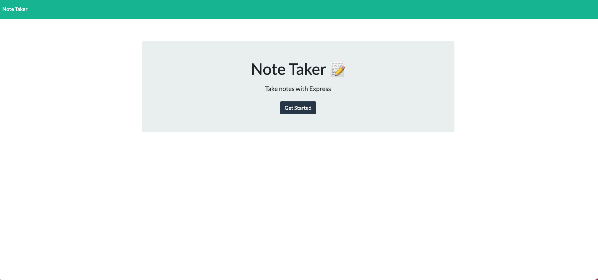
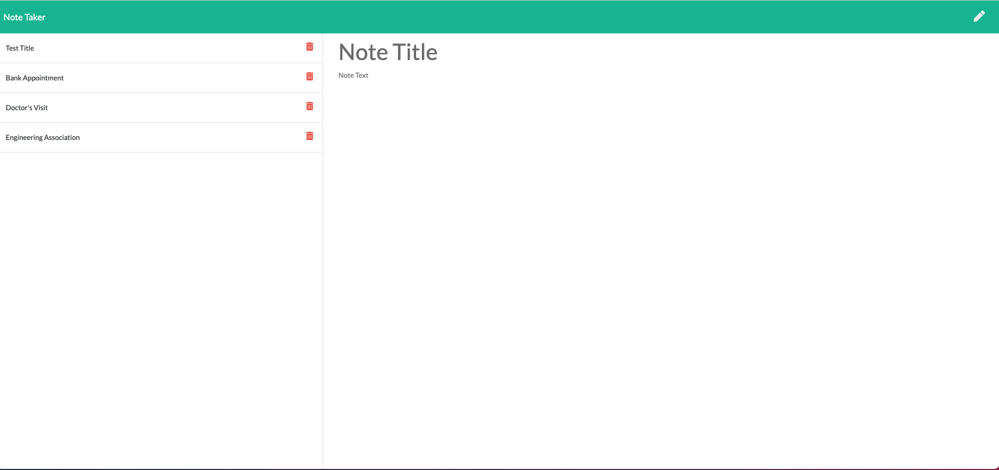

# Express.js: Note Taker
 

Node.js, Inquirer, Express, Heroku.

ramflorez@yahoo.com

# Deployed pages sreenshots

 

 

# Heroku link

[Heroku link](https://pacific-journey-40181.herokuapp.com/)

  
  ## Description 
  
  This application is created with node.js to allow creating an application called Note Taker that can be used to write and save notes.
  
  ## Table of contents
  
  - [Description](#Description)
  - [Installation](#Installation)
  - [usage](#usage)
  - [License](#License)
  - [Contributing](#Contributing)
  - [Test](#Test)
  - [Repository Link](#Repository)
  - [GitHub & Questions](#GitHub_&_Questions) 
  
  
  ## Installation
  
          First install npm packet (npm install ) including Inquirer  (npm install inquirer) and express packets (npm install express). Then, invoke the application by running node server.js. The port (local host )that should be used in the browser to find the Note Taker application will be shown.
  
  ## Usage
  
  Open the port in your browser, click the "Get Started" button. Then, write title for your notes, enter your notes and click the save button icon that shows when finished typing.
  
  ## License
  
  MIT
  
  ## Contributing
  
  Myself, Ramiro Florez, ramflorez@yahoo.com
  
  ## Test
  
  run node server.js
  
  
  ## Repository
  
  - [Project Repo](https://github.com/ramflorez/Note)
  
  ## JASON File

  Information is written on a db.json file.

  <a href="https://github.com/ramflorez/Note/blob/main/Develop/db/db.json"> JSON File</a>
  
  ## GitHub_&_Questions

  
  - Ramiro Florez
  - [GitHub Profile](https://github.com/ramflorez)
  - ramflorez@yahoo.com
  